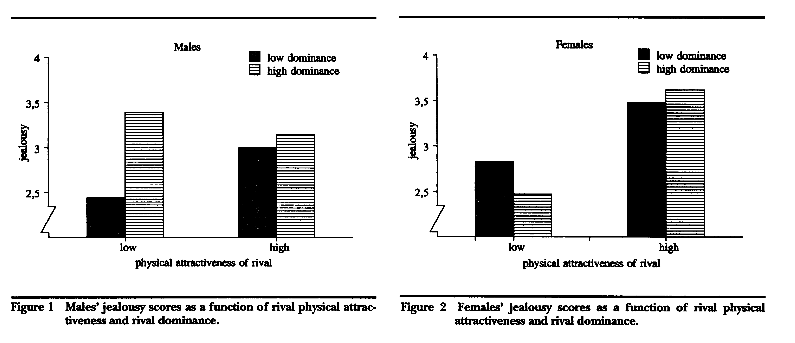
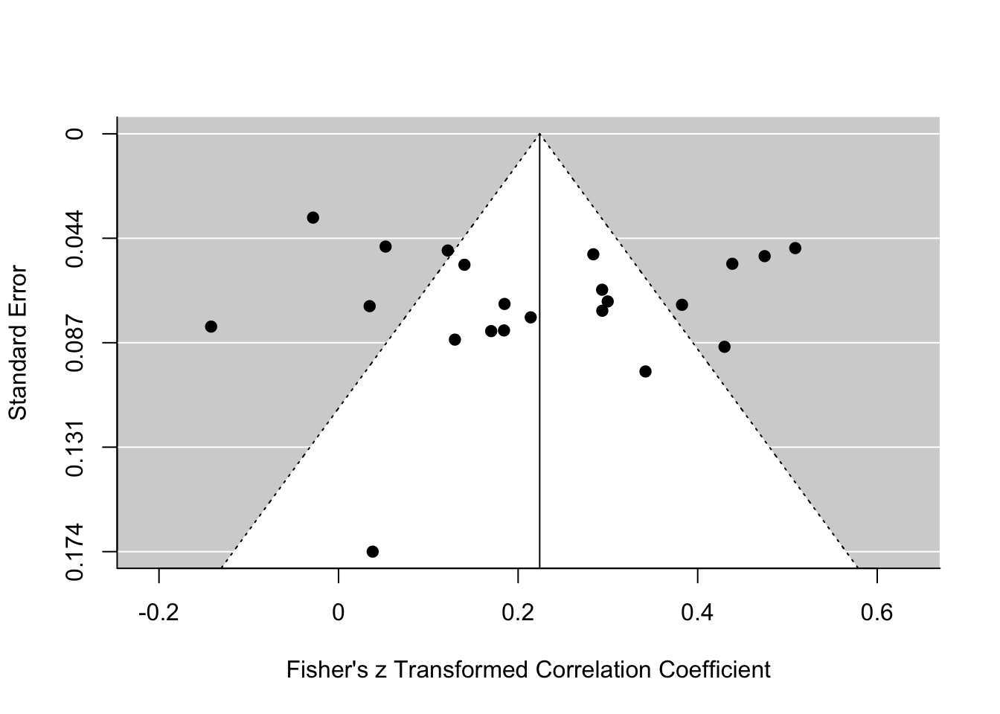
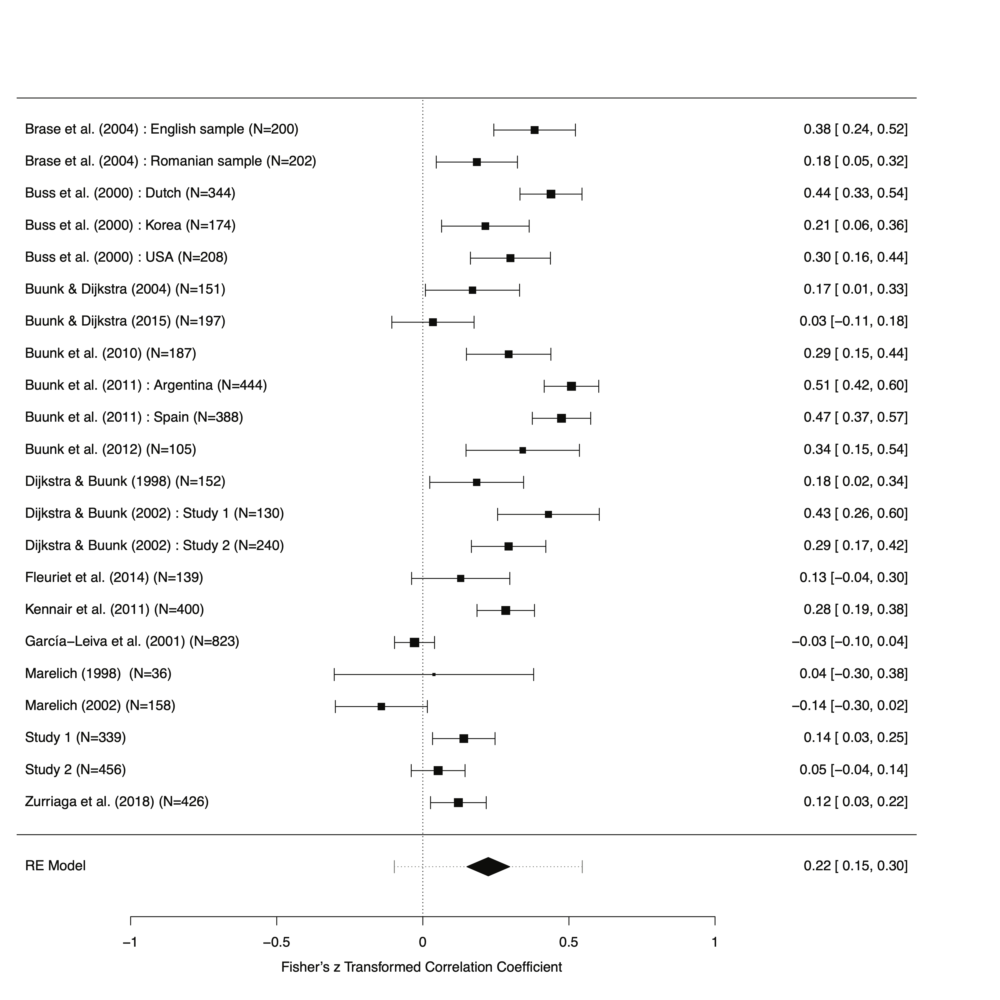
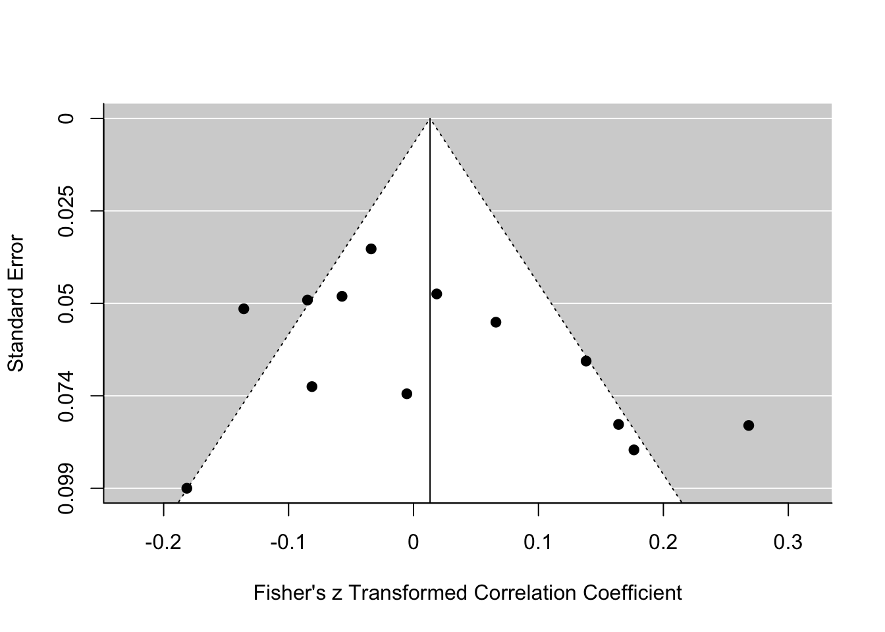
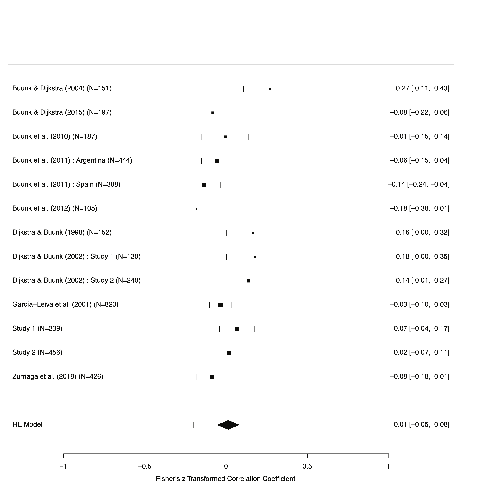
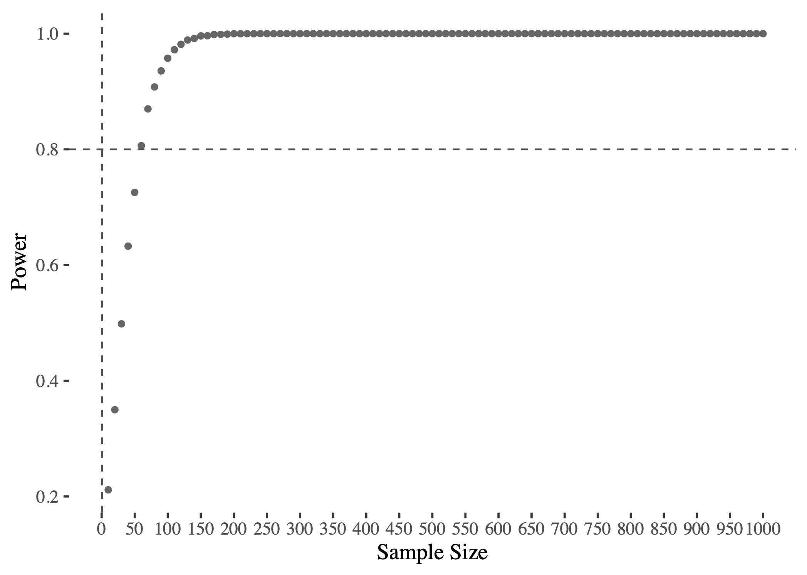
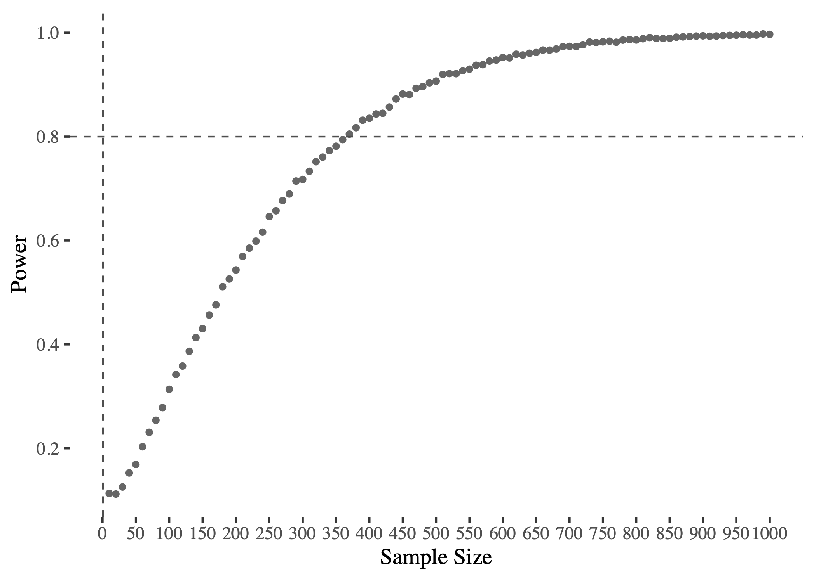

---
header-includes:
    - \usepackage{caption}
    - \usepackage{float}
title: "Jealousy as a Function of Rival Characteristics: Gender differences in reactions to rival attractiveness and dominance"
author: "Thomas V. Pollet (@tvpollet) & Tamsin K Saxton, Northumbria University"
date: "`r format(Sys.Date())` | [disclaimer](http://tvpollet.github.io/disclaimer)"
output:
  xaringan::moon_reader:
    lib_dir: libs
    nature:
      highlightStyle: github
      highlightLines: true
      countIncrementalSlides: false
  csl: evolution-and-human-behavior.csl
  bibliography: references.bib
---

```{r setup, include=FALSE}
options(htmltools.dir.version = FALSE)
knitr::opts_chunk$set(echo = TRUE)
library(knitr)
```


```{r, load_refs, echo=FALSE, cache=FALSE, warning=F, results='hide', message=F}
library(RefManageR)
BibOptions(check.entries = FALSE,
           bib.style = "authoryear",
           cite.style = 'alphabetic',
           hyperlink = FALSE,
           dashed = FALSE,
           style = "html")
myBib <- ReadBib("./myBib.bib", check = F)
```

```{r, xaringan_tile, echo=FALSE, cache=FALSE, warning=F, results='hide', message=F}
xaringanExtra::use_tile_view()
```


## Outline of talk today.

* Intro.

* Two replication studies (skimpy on the details) and meta-analyses

* (Quick and dirty) Simulation.

* Summary + further research.


```{r, out.width = "250px", echo=FALSE, fig.align='center'}
knitr::include_graphics("https://media.giphy.com/media/RHLcOWQ4xqyOKvqzAc/giphy.gif")
```

???
No need to extensive notes. References at end of slides.

---
## Replication crisis.

* Replication Crisis (e.g., Ritchie, 2020)

* Replication should become a routine activity (Zwaan et al. 2018)

* Built upon student project.

```{r, out.width = "500px", echo=FALSE, fig.align='center'}
knitr::include_graphics("https://media.giphy.com/media/PjBejIzN9BwsL8uQ0F/giphy.gif")
```

---
## Jealousy

* One of the core topics studies by evolutionary psychologists

* Topic which features

* Focus on sex differences... .

```{r, out.width = "500px", echo=FALSE, fig.align='center'}
knitr::include_graphics("https://media.giphy.com/media/3orieQ3sBIX58hgw92/giphy.gif")
```

---
## Dijkstra & Buunk (1998)

* Extension from previous work.

--

*  Vignette-based scenario: imagining their partner being approached by a potential other-sex romantic rival. 

--

* Men’s jealousy: particularly responsive to the dominance of the male rival.

--

* Women’s jealousy: particularly responsive to the attractiveness of the female rival.

--

* Sex difference predicted based on evolutionary theory regarding the relative importance of dominance and attractiveness to men’s and women’s appeal as a romantic partner

---
## Dijkstra & Buunk (1998): A closer look.

* 152 students completed a vignette study. (Between-subject design)

--

* Description: _"You are at a party with your girlfriend \[boyfriend], and you are talking with some of your friends. You notice your girlfriend \[boyfriend] across the room talking to a man \[woman] you do not know. You can see from his \[her] face that he \[she] is very interested in your girlfriend \[boyfriend]. He \[She] is listening closely to what she \[he] is saying, and you notice that he \[she] casually touches her \[his] hand. You notice that he \[she] is flirting with her \[him]. After a minute, your girlfriend \[boyfriend] also begins to act flirtatiously. You can tell from the way she \[he] is looking at him \[her] that she \[he] likes him \[her] a great deal. They are completely absorbed in each other.”_

--

* Manipulated attractiveness via photograph.


---
## Dijkstra & Buunk (1998): Dominance manipulation.

_“You find out that your girlfriend is flirting with Jonathan, the man in this photo. Jonathan is a student at \[Name of University where study was conducted] and is about the same age as you. Jonathan is also a teaching assistant and teaches courses to undergraduates. He is also president of a \[Name of University where study was conducted] activities club that numbers about 600 members. Jonathan knows what he wants and is a good judge of character. Jonathan also often takes the initiative to do something new, and he has a lot of influence on other people. At parties, he always livens things up.”_ The low-dominance version read as follows: _“You find out that your girlfriend is flirting with Jonathan, the man in the photo. Jonathan is a student at \[Name of University where study was conducted] and is about the same age as you. Jonathan attends classes regularly and is one of the 600 members of an activities club at \[Name of University where study was conducted]. Jonathan does not always know what he wants, and he often fails to understand what is going on in other people’s minds. Jonathan often waits for others to take the initiative and is rather compliant. At parties, he usually stays in the background.”_

For (heterosexual) women the name and gender of the rival were altered (_"Olivia"_ rather than _"Jonathan"_ (original: 'Hans')).

---
## Dijkstra & Buunk results.

* A three-way ANOVA: a significant Gender\*Attractiveness\*Dominance interaction. 

--

* **Key evidence**: two further significant interaction tests in ANOVA (Gender\*Attractiveness, Gender\*Dominance). 

--

* Participant gender interacted with the attractiveness of the rival: Women responded with more jealousy to an attractive rival, as opposed to an unattractive one, compared to men (interaction: $\eta^2_p$ = .033, based on our own calculations). 

--

* The dominance of the rival affected men to a greater degree than it did women (interaction: $\eta^2_p$ = .026, based on our own calculations).

---
## Graphical summary: Dijkstra & Buunk (1998 : 1163)

```{r, dijkstra_finding, out.width = "800px", echo=FALSE, fig.align='center'}

```

---
## Study 1.

* Matched facial stimuli closely on the original ratings. Images from DeBruine (2017).

--

* 339 self-identified heterosexual participants (target 380, 225 women) collected online + campus (2 Bachelor students).

--

* Majority current students (55%) and in a relationship (66%). The mean age was 22.48 years (_SD_ = 3.75 years, range = 18 - 57 years)

--

* Focus on same tests as Dijkstra & Buunk (1998). More on the [OSF](https://osf.io/zytdx/). Figures, manipulation checks, robustness tests, preregistration, etc.

---
## Study 1: Results.

* 2 x 2 x 2 interaction (gender * attractiveness * dominance) on ratings of jealousy was not statistically significant (*F*(1, 331) = 0.04, *p* = .849, $\eta^2_g$ < .01). 

--

* Evidence for the hypothesized Gender\*Attractiveness interaction effect, *F*(1, 331) = 6.55, *p* = .011, $\eta^2_g$ = .02. For women, an attractive rival, as opposed to an unattractive rival, elicited jealousy to a greater degree than it did for men. 

--

* No support for a Gender\*Dominance interaction on jealousy, *F*(1, 331) = 1.44, *p* = .231, $\eta^2_g$ < .01.

---
## Study 2.

* Minor tweaks (Wording vignette + Faces from Radboud Faces Database, Langner et al., 2010 -- close as possible to differences in Dijkstra & Buunk 1998).

--

* Run online via Prolific (N=406) and online opportunity sampling (N=52). We merged both samples for analyses (N=456, 278 women).

--

* Majority were current students (81%) and in a relationship (61%), restricted to self-identified heterosexual participants. Mean age was 23.34 years (_SD_ = 4.10 years, range = 18 - 56 years).

--

Again, additional tests, manipulation checks, preregistration and more information on [OSF](https://osf.io/wd7zv/).  


---
## Study 2: Results

* In line with Study 1, but unlike Dijkstra and Buunk (1998), the proposed 2 x 2 x 2 interaction was not statistically significant,*F*(1, 448) = 0.42, *p* = .518, $\eta^2_g$ < .01.

--

* Contrary to both Study 1 and the original paper, there was no statistical evidence for the hypothesized Gender\*Attractiveness interaction on jealousy,  *F*(1, 448) = 1.23, *p* = .268, $\eta^2_g$ < .01. 

--

* There was also no support for a Gender\*Dominance interaction, *F*(1, 448) = 0.15, *p* = .694, $\eta^2_g$ < .01. 

---
## Synthesis... 


```{r, Confusion, out.width = "500px", echo=FALSE, fig.align='center'}
knitr::include_graphics("https://media.giphy.com/media/521JLj0YGzz6AEWsZ5/giphy.gif")
```


---
## Meta-analysis strategy.

* Searched Web of Science and located 198 papers that used the term ‘jealousy’, plus either ‘partner’ or ‘rival’, plus either ‘trait’ or ‘characteristic’ or ‘attribute’ or ‘quality’ or ‘feature’ (and variants of those words, such as ‘traits’). 

--

* Obtained additional 27 candidate papers via Google Scholar (cited Dijkstra & Buunk, 1998 or related). 

--

* Final: 22 samples included. 5 : participants were exclusively heterosexual -- 0 focussed exclusively on non-heterosexual participants; 17 mean age was <26 years, 3 samples mean age  > 26, 2 did not provide participant ages; 15 used student (or majority student) participants and 6 did not (1 unspecified); 4 samples were collected within the USA while the remainder were based outside the USA.

More information in the paper or on [OSF](https://osf.io/wd7zv/).

---
## Meta-analysis: Attraction

```{r, funnel_attr, out.width = "700px", echo=FALSE, fig.align='center'}

```

---
## Meta-analysis: Attraction

```{r, meta_attr, out.width = "550px", echo=FALSE, fig.align='center'}

```

---
## Meta-analysis: Dominance

```{r, funnel_dom, out.width = "700px", echo=FALSE, fig.align='center'}

```


---
## Meta-analysis: Dominance

```{r, meta_dom, out.width = "550px", echo=FALSE, fig.align='center'}

```

---
## Statistical Power

Underappreciated, interaction effects requires much larger sample size.

Note this is an illustration for a different project. (Continuous scenario, assumptions met)

Using 'Simglm' (Lebeau, 2020), set up a simulation: 

let's assume $\beta_{3}$ = 0.15 (_Pearson r_ = .2, Peterson & Brown 2005)

Choice of $\beta_{1}$ and $\beta_{2}$ = 0.387 (i.e., $0.15 = 0.387 \times 0.387$).

Equation:

--


$$\hat y = \beta_1x_{1} +  \beta_2x_{2} + \beta_3x_{1}x_{2} + \epsilon$$

---
## Power simulation: Main effect.


```{r, main_eff, out.width = "500px", echo=FALSE, fig.align='center'}

```

---
## Power simulation: Interactive effect


```{r, int_eff, out.width = "500px", echo=FALSE, fig.align='center'}

```


---
## Summary

* Glass Half Full?

* Interaction effects require ample statistical power

```{r, out.width = "300px", echo=FALSE, fig.align='center'}
knitr::include_graphics("https://media.giphy.com/media/l378fyagYKVuXg2u4/giphy.gif")
```

---
## Any Questions?

[http://tvpollet.github.io](http://tvpollet.github.io)

Twitter: @tvpollet

```{r, out.width = "600px", echo=FALSE, fig.align='center'}
knitr::include_graphics("https://media.giphy.com/media/3ohzdRoOp1FUYbtGDu/giphy.gif")
```

```{r, echo=F, warning=F,results='hide'}
Citet(myBib, "Buss1992")
Citet(myBib, "Buss1999")
Citet(myBib, "DeBruine2017")
Citet(myBib, "Dijkstra1998")
Citet(myBib, "Lebeau2020")
Citet(myBib, "Peterson2005")
Citet(myBib, "Pollet2020")
Citet(myBib, "Ritchie2020")
Citet(myBib, "Zwaan2018")
```

---
## References (errors = blame RefManageR)

```{r, 'refs', results='asis', echo=FALSE, warning=F}
PrintBibliography(myBib, start=1, end=5)
```
